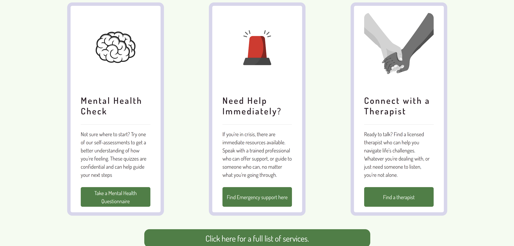

# MentalHealthSpace

MentalHealthSpace is a site dedicated to providing easily accessible information and resources on mental health.
It aims to provide an environment in which people suffering from mental health issues - and those aorund them - can come for
advice, be directed to appropriate resources and get their daily dose of positivity.

Author: Matt Cowen

[Live Site](https://matt-cowen.github.io/MentalHealthSpace/)

[Repository](https://github.com/Matt-Cowen/MentalHealthSpace)

## Features

#### Hompage

 > Fully responsive Hompage with a calming colour scheme and a welcoming message/image combination.

#### Services Page

 >Easily navigable services list with clear headers.

 #### Positive Affirmations Generator

 

>A fun and positive generator for your daily positive affirmations!

>A footer with links to MentalHealthSpace's socials and a message of encouragement.

## UX

The site is presented in a minimalist but effective way, providing access all the resources the user might wish to have access to, with a light emphasis on crisis care. The site simply and clearly covers many facets of mental health, and directs the user to appropriate resources in a quick and easy manner, all with a calming lavendar and green colour scheme.

### Project Brief

>The user seeks accessible, beginner-friendly information on mental health, including how to recognize common issues and manage stress, presented in a supportive and organised layout.

#### Site Owner’s Goal:
>The site owner wants to create a welcoming webpage that provides basic mental health information using a clean and supportive design. The focus is on using HTML and CSS with Bootstrap to create a calming and well-organised user experience.

#### Potential Features might Include:

Hero Section with Positive Messaging: A Bootstrap Jumbotron with an encouraging message about mental health, using a calming colour scheme and a simple background image.  

Information Cards: Use Bootstrap’s card components to present mental health tips and common issues, providing a visually appealing way to organise content  

Resource Links: A grid layout for external links to mental health resources, styled with Bootstrap buttons to make them stand out. 

Positive Affirmations: Use Bootstrap’s text utilities to include a section with uplifting quotes or messages to encourage users. 

#### User Stories

* As a new user of this website, I want to easily find out the purpose of the site.
* As a new user of this website, I want to quickly and easy find services appropriate to my needs.
* As a user of this website, I want to feel welcomed and reassured on arriving at the site.
* As a user of this website, I want to be provided with access to a list of positive affirmations.
* As a user, I want to follow the salon on social media so I can keep up to date with the latest information.

## UI

### Homepage
 

 The homepage has been kept as simple as possible to remove any potnetial confusion/stress for new visitors to the site. It catches the user with a welcoming and reassuring message and image, and leads them down the the "Here to Help" section, where they can choose one of three main services displayed on cards. If they are looking for a more specific services, a large button towards the bottom links them to the "Services" page (displayed below.)

### Services
 

 The services page was created to reduce information overload on the landing page, whilst still managing to proivide a large amount of information to the user in an easily digestible way. The Services are divided into type by section, and displayed on fully responsive bootstrap grid cards, with large images to convey the services they represent, allowing the user to pick the service they require quickly and easily.

### Positive Affirmations
(screenshot in Features section)

When trying to add Positive Affirmations (as per client suggestion) it was found that there wasn't a way to introduce them to either of the other pages without them becoming too busy and cluttered. The Positive affirmations page was added such that the user could access a large list of positive affirmations without any distraction from other mental health related content. It departs slightly from the general colour scheme of the rest of the site to impart an impression of positivity and joy.

## Future Features

* More Positive Affirmations!

## Testing

 * HTML validated through [W3C](https://validator.w3.org/)
 * CSS validated through [W3C](https://jigsaw.w3.org/css-validator/validator)

## Deployment

* The site was deployed to GitHub pages. The steps to deploy are as follows:
    * In the GitHub repository, navigate to the Settings tab
    * From the source section drop-down menu, select the Main Branch
    * Once the master branch has been selected, the page will be automatically refreshed with a detailed ribbon display to indicate the successful deployment.
    * The live link can be found here - https://matt-cowen.github.io/MentalHealthSpace/

## Known Issues

* Helpcards slightly misaligned at the bottom when between lg and x-lg breakpoints.

* I acknowledge that the code in this project is a little messy, given time and a more solid subject matter, I could clean it up!

## Acknowledgements

All copy for this project was produced by  **ChatGPT**, a language model developed by [OpenAI](https://openai.com).

All open source images were taken from [UnSplash](https://unsplash.com/)

The code behind the Positive Affirmation Generator was written by Eleanor Keane, accessed via **Dominck** on [Codepen](https://codepen.io/Tyrantd27)

Fonts from [Google Fonts](https://fonts.google.com/)

Icons from [FontAwesome](https://fontawesome.com/)

